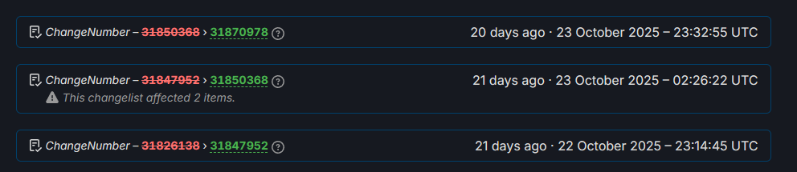

# :material-update: Possible Game Updates

Been long time due, but it is becoming likely that the game *may* receive a future update due to a few hints here and there.

## :material-steam: SteamDB Updates

Before explaining why, it is important to describe what [SteamDB](https://steamdb.info/) is and how Relink ties to it.

**SteamDB** is a an unofficial database that tracks all of Steam's backend changes for every app on the store. Changes made to an app's store page, configuration, steam cloud mechanisms, linked DLCs, pricing, tag, review status and more, are recorded and shown there.

There is also the concept of **branches**, which is essentially a repository that houses game contents. An app may have multiple of these (beta, release, etc), but most importantly, besides the main branches, their contents are **not accessible to the public**, but we could still know if they existed. Keep this in mind for later.

All of Relink's changes are recorded [here](https://steamdb.info/app/881020/history/), as App ID `881020`.

---

When Relink released back in February 2024, multiple branches could be seen:

* `public` - This is the main branch, the game contents available to everyone.
* `testbranch` - Not accessible to the public.

But also these:

* `masterbr-v1_1-master` - [v1.1](https://store.steampowered.com/news/app/881020/view/5967904736245841871), released on March 14, 2024
* `masterbr-v1_1-master_qa` - Quality Assurance/Testing build
* `masterbr-v1_2-master` - [v1.2](https://store.steampowered.com/news/app/881020/view/4185608896913543699), released on April 26, 2024
* `masterbr-v1_2-master_qa`
* `masterbr-v1_3-master` - [v1.3](https://store.steampowered.com/news/app/881020/view/4188989767891425332), released on May 31, 2024
* `masterbr-v1_3-master_qa`

...which represents every update up until now. Essentially the updates were already **completed ahead of time** (ignoring bug fixes), and mainly provided the game assets. 

The functionality was merely locked behind executable flags (which is why Sandalphon and [Zero](https://www.youtube.com/watch?v=F72wGvY4fvk&feature=youtu.be) could be played ahead of their update, and Cygames even went as far to take down a video that was showcasing Sandalphon).

Finally, there were two other branches, added later on before 1.3:

* [`kanaria`](https://steamdb.info/app/881020/history/?changeid=23496797) - Likely 'canary'
* [`okameinko`](https://steamdb.info/app/881020/history/?changeid=23496759)

---

One common thing across the `masterbr` and `kanaria`/`okameinko` branches was that they were updating on a daily basis, around the same specific hours (~22:30 UTC). This is a sign that a [CI Pipeline](https://en.wikipedia.org/wiki/CI/CD) was being used. In short, a CI Pipeline is a process that automatically compiles the game and its assets on a server, and in this case, uploads it to Steam. In software development, this is usually scheduled to occur overnight. In this case, 22-23 UTC seemed to have been chosen. 

After 1.3, [04 June 2024](https://steamdb.info/app/881020/history/?changeid=23812958) was the last time we saw one of these daily updates, as they were likely shutting those CI Pipelines down and the game was complete.

Somewhere around late 2024/early 2025, [Steam removed the ability to know about private branches and their existence](https://steamdb.info/faq/#privatebranches). This wasn't much of a concern since Relink pretty much saw no updates on the backend. The only updates that could be seen on SteamDB were [global changes](https://steamdb.info/faq/#changenumber), for instance a user store tag that was updated could be compacted as one change across multiple apps completely unrelated, so nothing app-specific.

### And then...

On [13 August 2025](https://steamdb.info/app/881020/history/?changeid=30564811), we saw some suspicious looking changes that were not bound to multiple games, changes specific to Relink's steam backend.

More notably...

<figure markdown>
  { width="800" }
  <figcaption>The times look oddly similar..</figcaption>
</figure>

This goes on daily. At the time i'm writing this (12 November 2025), every day sees a new change on the update history.

The explanation for this may be that, if you've guessed correctly - someone turned the CI Pipelines back on, and these changes are going to those previously-visible branches, that Steam does not display anymore. The only reason to be doing this would be if development has resumed and testing was needed. CI Pipelines can be costy to run on large scale projects that may take hours to compile from scratch. Reminder that it would also need to be done for PS4, and PS5.

### Bonus: Unknown App

On 23 October 2025, a change was made that looked even more suspicious:

<figure markdown>
  { width="800" }
  <figcaption>Source: <a href="url">https://steamdb.info/app/881020/history/?changeid=31850368</a></figcaption>
</figure>

<figure markdown>
  { width="800" }
  <figcaption>Source: <a href="url">https://steamdb.info/changelist/31850368/</a></figcaption>
</figure>

A change occured that affected Relink, and some other app. The term app is actually used loosely here - an app on steam represents a product on Steam, that does not necessarily need to be available. It could be a game, software, a demo, or a DLC.

The thing is that, app `4131170` is totally unknown and hidden from the store. We don't know anything about it. We only know that it's also updated of its own.

<figure markdown>
  { width="800" }
  <figcaption>Source: <a href="url">https://steamdb.info/app/4131170/history/</a></figcaption>
</figure>

The initial change that "affected 2 items" is likely Relink being registered to a DLC, or something else. We have little information here, but we can only speculate.

A DLC change when not hidden, looks like this:

<figure markdown>
  { width="800" }
  <figcaption>Source: <a href="url">https://steamdb.info/changelist/22755897/</a></figcaption>
</figure>

---

We can only base ourselves on previous visible changes, so while it may be likely, please take anything written on this page with a grain of salt. 

I (Nenkai) trust to have made enough research on this subject, but as always, things may and can be subject to change.