# Id (Pl1900/Pl2000)

## Default

  { width="400" } 
  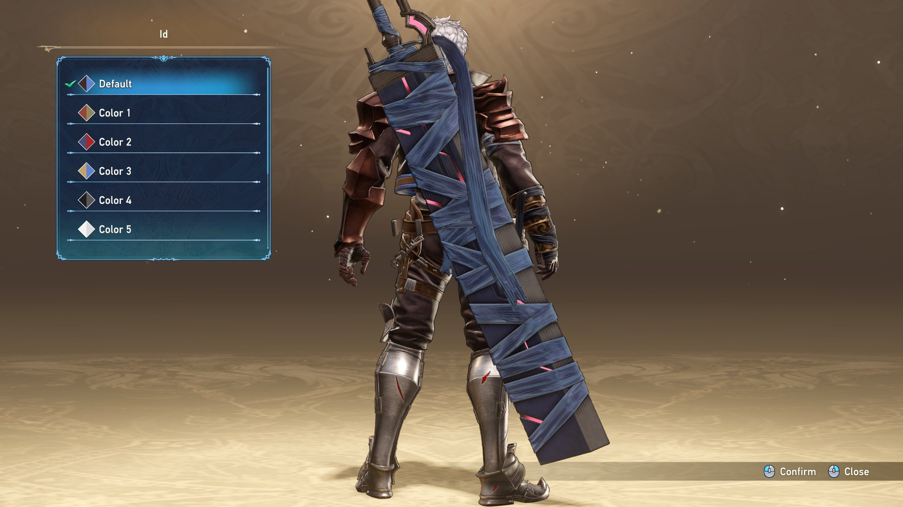{ width="400"}

  { width="400" } 
  { width="400"}

## Color 1

  { width="400" } 
  { width="400"}

  { width="400" } 
  { width="400"}

## Color 2

  { width="400" } 
  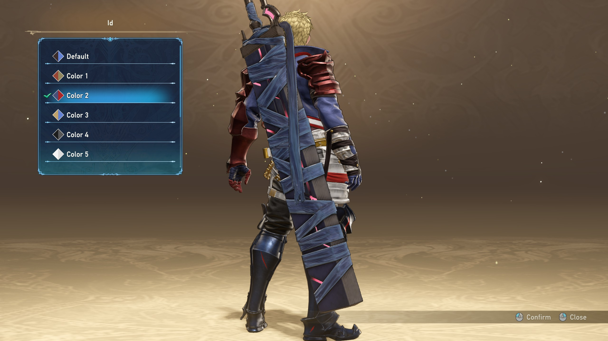{ width="400"}

  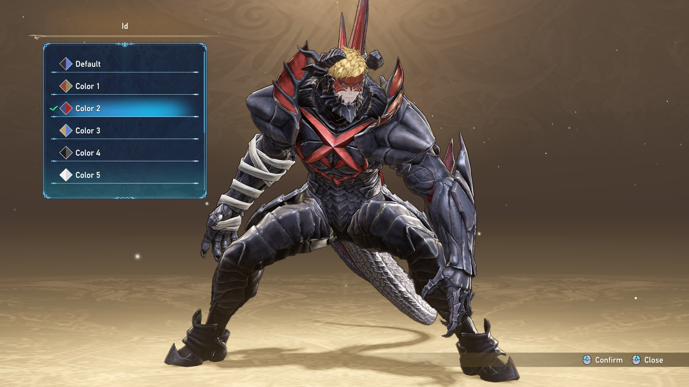{ width="400" } 
  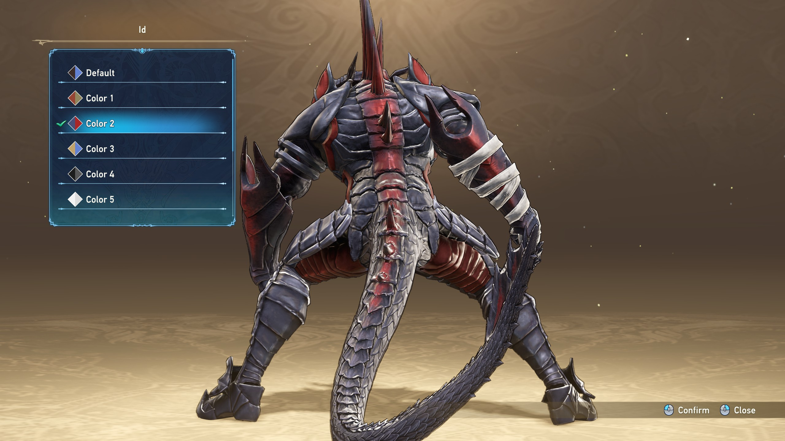{ width="400"}

## Color 3

  { width="400" } 
  { width="400"}

  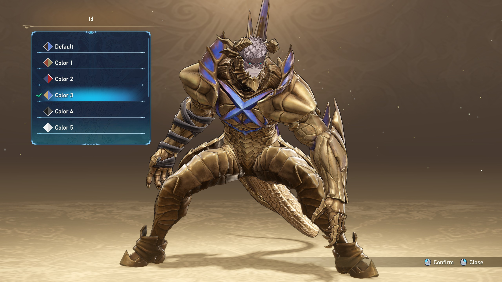{ width="400" } 
  { width="400"}

## Color 4

  { width="400" } 
  { width="400"}

  { width="400" } 
  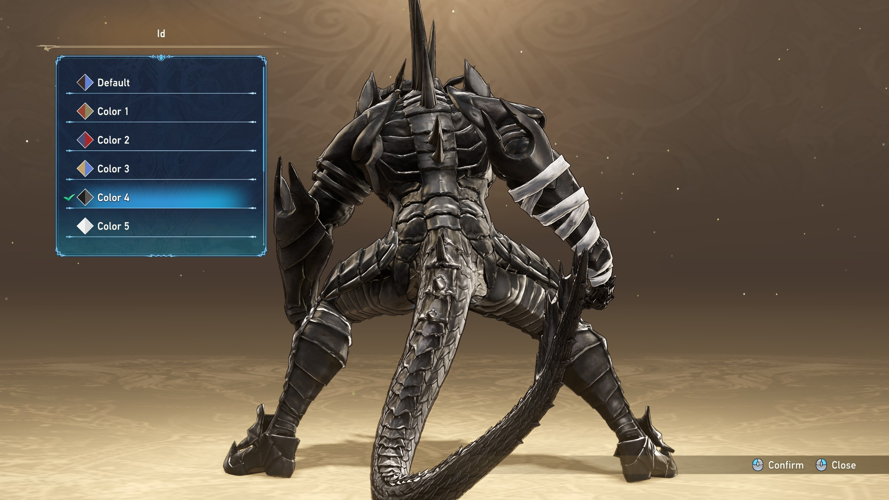{ width="400"}

## Color 5

  { width="400" } 
  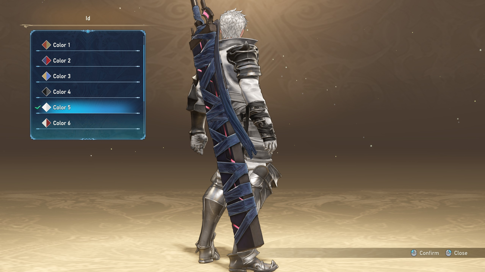{ width="400"}

  { width="400" } 
  { width="400"}

## Color 6 ([Color Pack 1](https://store.steampowered.com/app/2183570/Granblue_Fantasy_Relink__Color_Pack_1/))

  { width="400" } 
  { width="400"}

  { width="400" } 
  { width="400"}

## Color 7 ([Color Pack 2](https://store.steampowered.com/app/2694640/Granblue_Fantasy_Relink__Color_Pack_2/))

  { width="400" } 
  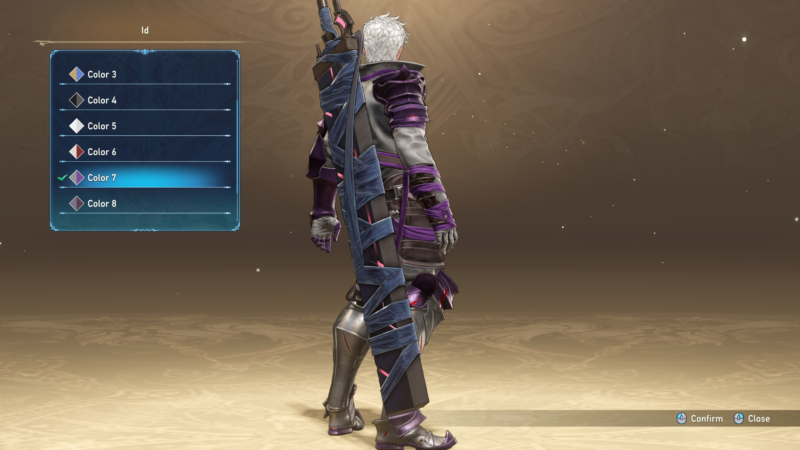{ width="400"}

  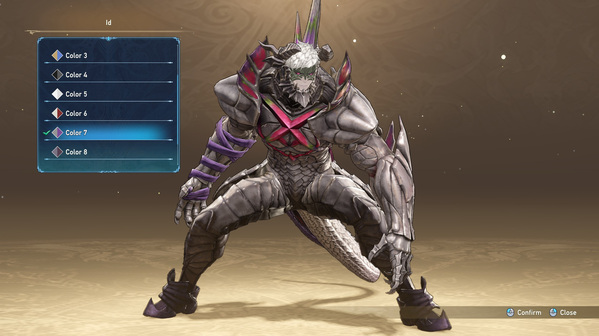{ width="400" } 
  { width="400"}

## Color 8 ([Color Pack 3](https://store.steampowered.com/app/2694650/Granblue_Fantasy_Relink__Color_Pack_3/))

  { width="400" } 
  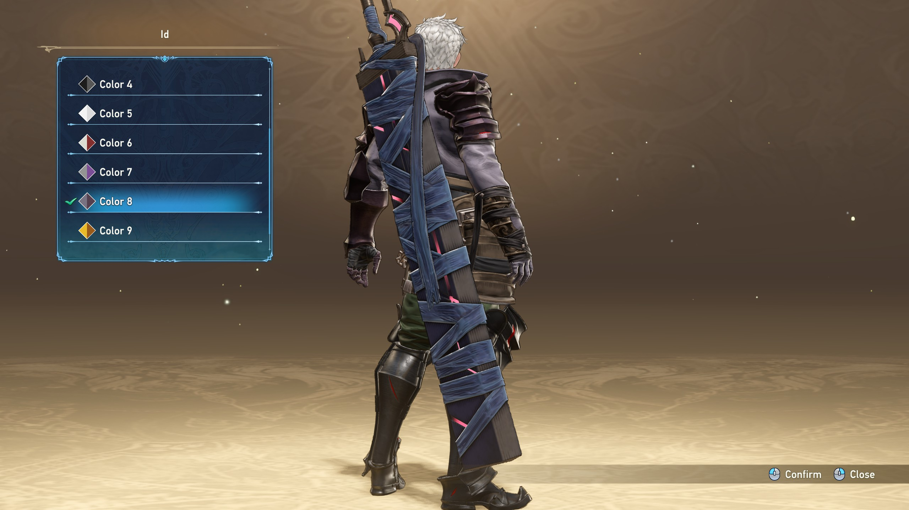{ width="400"}

  { width="400" } 
  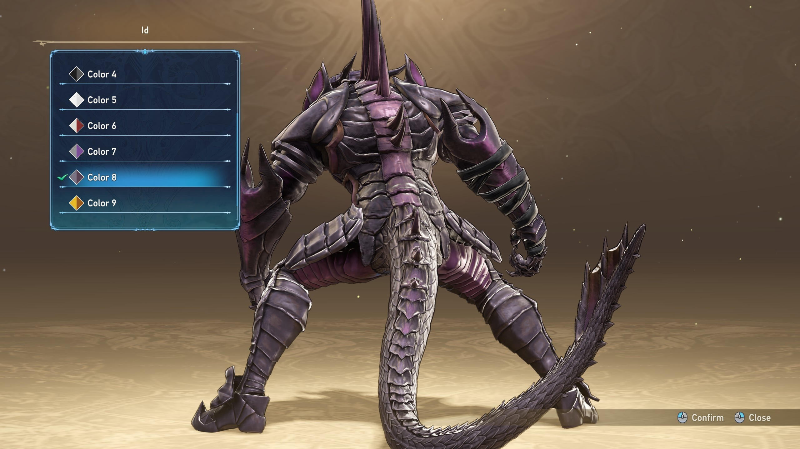{ width="400"}

## Color 9 ([Color Pack 4](https://store.steampowered.com/app/2853970/Granblue_Fantasy_Relink__Color_Pack_4/))

  { width="400" } 
  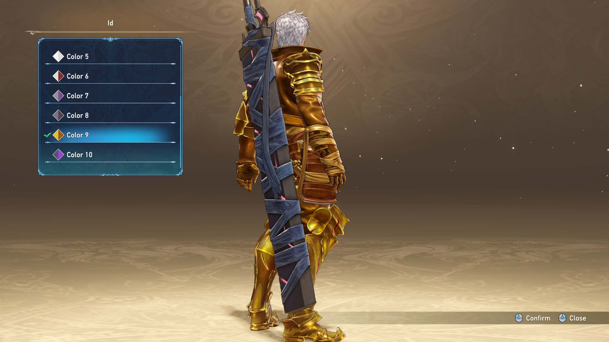{ width="400"}

  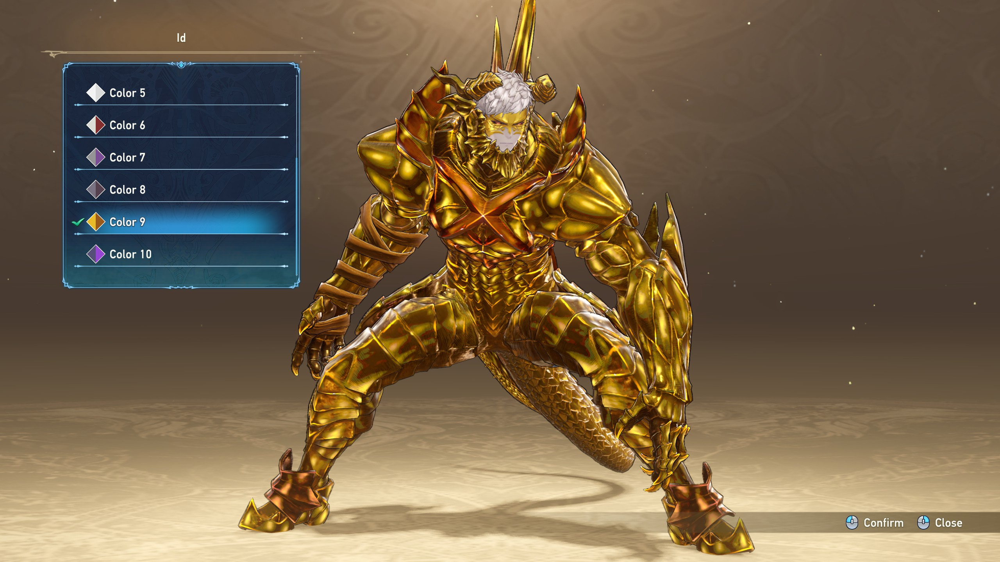{ width="400" } 
  { width="400"}

## Color 10 ([Color Pack 5](https://store.steampowered.com/app/2944850/Granblue_Fantasy_Relink__Color_Pack_5/))

  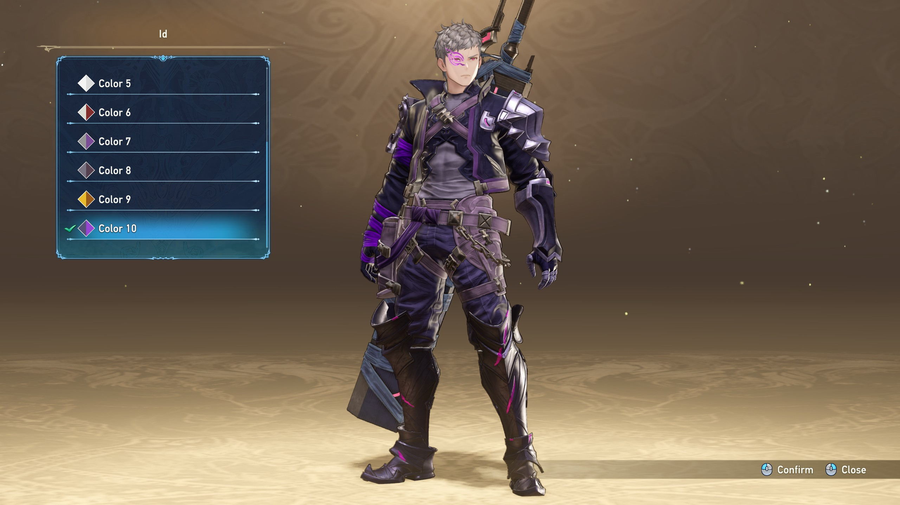{ width="400" } 
  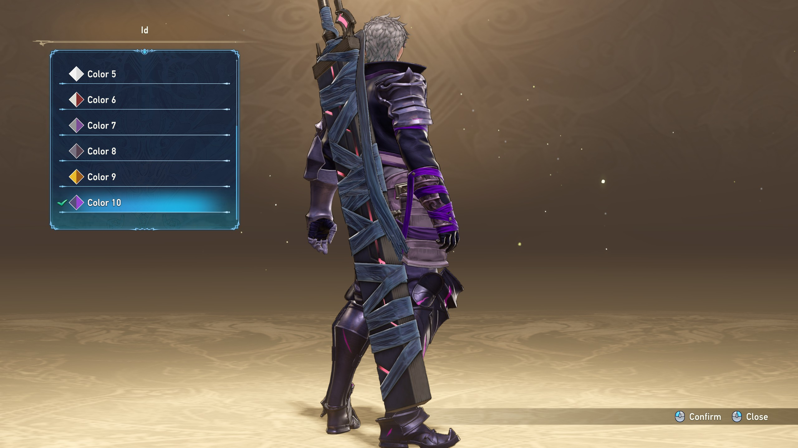{ width="400"}

  { width="400" } 
  { width="400"}

