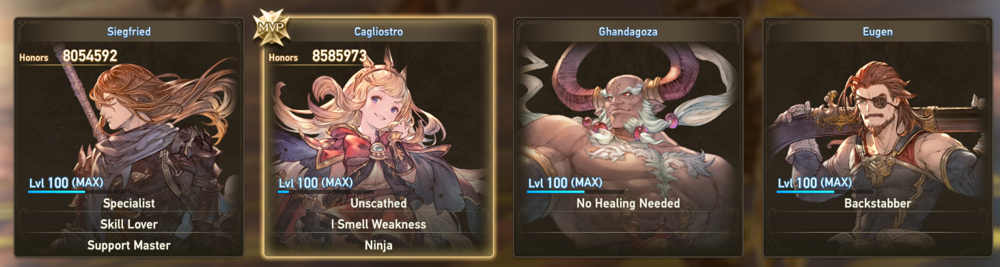

# :material-trophy-award: Quest Result Titles (Evaluation)

The evaluation system is responsible for awarding characters titles on the results screen (if the quest was successful). 

<figure markdown>

</figure>

Up to 3 titles can be earned by characters (no duplicates) across them. Up to 39 titles are available.

| Name                       | Title                | Obtained by          | Minimum for display           |
| ---------------------------|----------------------|----------------------|-------------------------------|
| EVA_STABLE_BATTLE          | Rock Steady          | Max amount of time spent in high health | >= 60.0s 
| EVA_BACK_WATER             | Fighting with Enmity | Time spent in low health (<= 25%)   | >= 60.0s 
| EVA_LIKE_GUARD             | Guard Lover          | Number of successful guards         | >= 5 
| EVA_MASTER_OF_GUARD        | Guard Master         | Number of successful perfect guards | >= 5 
| EVA_GUARDIAN               | Guardian             | Rock Steady + Guard Lover           | >= 60s & >= 5
| EVA_LIKE_DOUGE             | Dodge Lover          | Number of successful dodges         | >= 10 
| EVA_PERFECT_DOUGE          | Dodge Master         | Number of successful perfect dodges | >= 5 
| EVA_BRILLIANT_STEP         | Ninja                | Rock Steady + Dodge Lover           | >= 60s & >= 5
| EVA_SKY_ATTACK             | Aerial Assaulter     | Number of airborne attacks          | >= 20 
| EVA_BACK_ATTACK            | Backstabber          | Number of back attacks              | >= 20 
| EVA_CRITICAL_ATTACK        | Lord of Crits        | Number of critical attacks          | >= 20 
| EVA_LINKATTACK_BIRTH       | Link Starter         | Number of link attack opportunities | >= 5 
| EVA_LINKATTACK_SUCCESS     | Link Master          | Number of times link attack landed  | >= 5 
| EVA_LIKE_ABILITY           | Skill Lover          | Number of skills used               | >= 5 
| EVA_LIKE_SPECIFIC_ABILITY  | Specialist           | Number of times a specific skill has been used | >= 5 
| EVA_SUPPORT_MASTER         | Support Master       | Number of buffs given to other characters | >= 5 
| EVA_RESCUE                 | Healer               | Number of times healed              | >= 10 
| EVA_NO_DEAD                | Helping Hand         | Number of heals to others at low health (<= 25% health) | >= 2 
| EVA_NEVER_GIVEUP           | Paramedic            | Number of revives to others (including manual revives)  | >= 5 
| EVA_START_SPARTS           | SBA Trigger          | Has used SBA at least once | SBAed once
| EVA_NO_ESCAPE              | Jamming Expert       | Number of successful debuffs (except atk/def debuff - status 1000 through 1019) | >= 5 
| EVA_DEBUFF_MASTER          | Debilitator          | Number of successful debuffs (atk/def debuff - status 2 & 3) | >= 5 
| EVA_DESTROYER              | Destroyer            | Parts destroyed | >= 3 
| EVA_LAST_ATTACK_ME         | Last Hit             | Did Last Attack | Last Attack owner 
| EVA_ENEMY_BUSTER           | Executioner          | Number of enemies killed | >= 5
| EVA_LIKE_JUMP              | Bunny Hopper         | Number of jumps | >= 20 
| EVA_RUNNER                 | Long-Distance Runner | Distance travelled (running or not) | >= 1000.0 units 
| EVA_COMMU_MASTER           | Sticker Lover        | Number of stickers sent | >= 5 
| EVA_CHATTER                | Chatterbox           | Number of chat messages (including preset chat messages) sent | >= 5 
| EVA_GOOD_EXPRESSION        | Emotional Anchor     | Number of gestures (including chat messages gestures) sent | >= 5 
| EVA_NO_CURE_DRAG           | No Healing Needed    | No healing |  Healed flag is false 
| EVA_REAL_TIME_CURE         | Resourceful          | Number of picked items that heal you (ITEM_13_0004 dropped by i.e Orbs in Proud Radis) | >= 5 
| EVA_NICE_THROW             | Star Pitcher         | Number of item throws in battle (gyre)  doesn't have to be landed on an enemy | >= 5 
| EVA_ICE_CURE               | Warming Hand         | Number of glaciate (status 1004) breaks/dispels | >= 2 
| EVA_SAND_CURE              | Excavator            | Number of sandtomb (status 1006) breaks/dispels | >= 2 
| EVA_DEBUFF_CURE            | Purifying Hand       | Number of successful dispels | >= 2 
| EVA_WEAK_POINT             | I Smell Weakness     | Number of weakpoint attacks (elemental) | >= 5 
| EVA_FAST_ATTACK            | Rusher               | Times attacked an enemy first | >= 5 enemies 
| EVA_LINKTIME_ATTACK        | Quick as Lightning   | Number of attacks during link time? | >= 50 
| EVA_NO_DAMAGE              | Untouchable          | No damage received | Not been hit flag

---

First, the game fetches the [evaluation.tbl](../../../tables/table_database.md) table. It contains the text strings used for localizing the titles, aswell as a **priority column**, which is used as a sort key for prioritizing certain titles harder to achieve than others. 

!!! note 
    
    The evaluations are largely hardcoded, it is not possible to add, edit, or remove them through data. The only editable component is the priority of the evaluation table.

The quest starts, and the game keeps track of various title/evaluation counters for each character in the party.

When the battle ends:

- The game creates a list of pairs `(uint, uint)` where element 0 is third column from evaluation table aka priority, element 1 is evaluation type (id, follows order of above table). This list is then sorted by priority, descending.
- It creates another list for each player, which stores their 3 final evaluation type along with 3 priority.
- Iterates through the first pair list. For each evaluation type of the list:
	- Runs a function specific to said evaluation and checks each player if has met requirements to show based on their conditions, and then find out which player has the highest counter. Returns a list of player indices, ordered by highest amount to lowest (always returns 4 entries regardless of how many characters in party)
	- Said list is truncated to the actual number of players in the quest.
	- Appends to the other list (indexed by the player index of highest counter for the current type) the evaluation type and priority, if the 3 slots aren't yet taken. This ensures that there won't be duplicates across players.

The second list now contains the final titles for each player (aswell as their priority, which is then used for honors/MVP as a separate computation).

---

Credits:

- Nenkai (reverse-reversing, information)
- Patemaani (information)