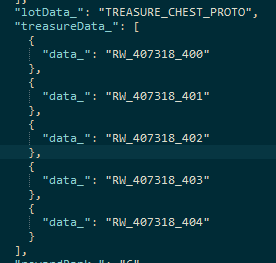
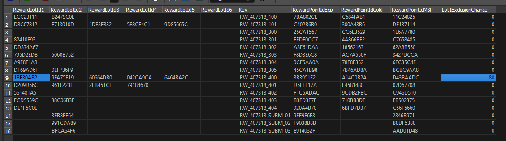

# :material-sword: Terminus Weapon Roll Algorithm

Terminus Weapons are drops from the 'The Tale of Bahamut's Rage' [quest](https://nenkai.github.io/relink-modding/resources/quest_ids/) (ID 407318).

It may reward an exclusive weapon for a random character (post-release characters do not have a Terminus weapon.).

Relevant [game tables](../../../tables/table_list.md):

* `reward`
* `reward_lot`

First, the quest's [base info file](../../quests_layouts/quest_base_info.md) declares that it will use the following chests on completion (treasures, in `treasureData_`):

* `RW_407318_400`
* `RW_407318_401`
* `RW_407318_402`
* `RW_407318_403`
* `RW_407318_404`

<figure markdown="span">
  { width="300" }
</figure>

`RW_407318_400` is the chest where one of its 5 reward 'lots' are the terminus weapons, as per the `reward` table. This row has `Lot1ExclusionChance`, which specifies that its first lot will have a **80%** of being excluded. 

This translates to **20%** chance of appearing, or **1/5**.



Heading to `reward_lot` with key `1BF30AB2`, we can see the list of all weapons.


Whenever `WeaponId` is set, the game treats the lot as being rollable **only if that weapon hasn't already been rolled, and the character has already been unlocked**.

The game iterates though the list of reward lots, makes a sum of the `Weight` column for all available weapons & their character.

A random number is rolled which we will call `value` = `rand() % totalWeight`.

It then iterates through rows again, checks if the lot is available again (otherwise goes to the next one), and checks if `value` is below the current lot's weight. If so, the weapon is **then rolled**, and the entire algorithm for that lot *ends*. This ensure that you cannot roll more than one weapon. Otherwise, `value -= current lot's weight`, and moving on to the next row.

TLDR: **Chance to get ANY weapon is always 20%.** The chance to roll for a specific character **becomes higher the LESS characters you have unlocked.** You can only roll for characters that you have unlocked. You cannot have more than one character's terminus weapon.

!!! note

    There is special hardcoding to handle Gran/Djeeta as one single weapon/character. (Most of the game does this when it comes to captain, checking maaaany times for Gran or Djeeta's character code).

---

## Full Algorithm

This is the full reverse-engineered algorithm dumbed down and simplified into pseudo-code.

```
get reward row from quest's reward id
  get reward lot 1 with Reward->RewardLotId1 IF lot exclusion chance % is not set, or a random % number is above it
  
    // start establishing a list of eligible items (by building total weight)
    set TotalWeight = 0
    
    foreach reward lot where reward lot = reward lot id
      check if should give weapon:
        // StoryDiff 3 = Ultimate.
        - check if (storyDiff == 3 AND curRewardLot->StoryDifficulty == 3) or (storyDiff != 3 AND (curRewardLot->StoryDifficulty == -1 OR curRewardLot->StoryDifficulty == storyDiff))
        - check if curRewardLot->RewardRank == -1 OR curRewardLot->RewardRank == currentRewardRank
        - check if already has weapon in save (weapon id)
        - check if character is unlocked by grabbing get WeaponData->CharaId and checking in the current available character list (in save)
      if check pass all above
        TotalWeight += currentRewardLotRow->Weight
        
    if TotalWeight == 0
      return // no reward.
      
    set chance = rand() % totalWeight
    foreach reward lot where reward lot = reward lot id // (again)
      check if should give weapon (same checks)
        if chance < currentRewardLotRow->Weight
          push weapon reward lot in list of rewards
          return // done. bail early because we don't want to give more than one.
        else
          chance -= currentRewardLotRow->Weight
  // do the same for Reward->RewardLotId 2/3/4/5/6 if they are set, without exclusion check (reserved to lot 1)
```

Function signatures:
```
void RewardManager::GetReward(RewardManager *a1, void *a2, unsigned int rewardLotId, unsigned int storyDifficultyType, int rewardRank, char a6);
41 57 41 56 41 55 41 54 56 57 55 53 48 83 EC ? 48 89 54 24 ? 8B 69

bool RewardLotData::ShouldGiveWeapon(RewardLotData *a1, uint storyDifficultyType, int rewardRank)
41 56 56 57 53 48 83 EC ? 0F B6 41

bool WeaponManager::HasWeapon(WeaponManager *a1, uint weaponId)
56 57 4C 8B 41
```